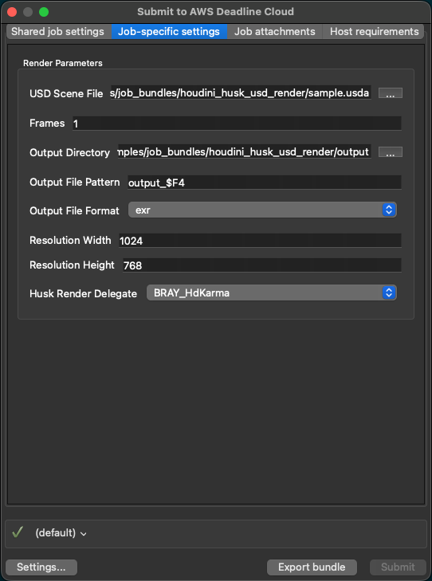

# Husk Rendering and USD Workflows

## USD Export Workflow Support

**The Deadline Cloud submitter for Houdini does not currently have built-in support for USD export workflows.** 

This means you cannot use the submitter node to create a single job that will export a USD scene from Houdini and then call Husk standalone to render wihtout consuming a Houdini Engine license.

## Alternative: Example Husk Job Bundle

AWS Deadline Cloud provides an [**example Husk job bundle**](https://github.com/aws-deadline/deadline-cloud-samples/tree/mainline/job_bundles/houdini_husk_usd_render) that enables USD export rendering workflows outside of the Houdini submitter. You will need to export the USD scene yourself separately from Houdini before using the example job bundle. 

The Husk example job bundle:
- Allows direct submission of USD scenes for rendering via Husk and a chosen Hydra render delegate without launching Houdini and consuming a Houdini engine license during the render
- Automatically introspects USD files to find any file dependencies within to attach using job attachments
- Provides a simple GUI for configuration of common Husk settings and submission

### Prerequisites

Before using the Husk example job bundle, you will need:

* A scene exported to USD format
    * See the [SideFX USD documentation](https://www.sidefx.com/docs/houdini/solaris/output.html) for information on writing out USD files in Houdini.

* The AWS Deadline Cloud CLI installed and configured
    * The CLI can be installed from either the submitter installer or directly following the Deadline Cloud [getting started guide](https://github.com/aws-deadline/deadline-cloud/blob/mainline/docs/index.md#getting-started).

* A git clone of the [Deadline Cloud samples repository](https://github.com/aws-deadline/deadline-cloud-samples)

* The Hydra render delegate available on the worker nodes
    * Karma is included with Houdini. If you want to use other Hydra render delegates then you must provide them on the worker. See the deadline-cloud-samples repository for example Conda packages for[V-Ray](https://github.com/aws-deadline/deadline-cloud-samples/tree/mainline/conda_recipes/houdini-vray-7) and [Redshift](https://github.com/aws-deadline/deadline-cloud-samples/tree/mainline/conda_recipes/houdini-redshift-2026) as one option to make them available on the worker nodes.

### To Use the Husk Example Job Bundle

1. Submit the bundle using the Deadline CLI:
   ```
   deadline bundle gui-submit ./deadline-cloud-samples/job_bundles/houdini_husk_usd_render
   ```

2. Configure your USD file, output settings, frame range, and any other applicable settings to submit



## Additional Resources

- [Deadline Cloud samples repository](https://github.com/aws-deadline/deadline-cloud-samples)
- [SideFX Husk documentation](https://www.sidefx.com/docs/houdini/ref/utils/husk.html)

## Getting Help

- Contact AWS Support for help getting started with AWS Deadline Cloud
- For issues with the Houdini submitter [open an issue in `deadline-cloud-for-houdini` on GitHub](https://github.com/aws-deadline/deadline-cloud-for-houdini/issues)
- For issues with the Husk example job bundle [open an issue in `deadline-cloud-samples` on GitHub](https://github.com/aws-deadline/deadline-cloud-samples/issues)
