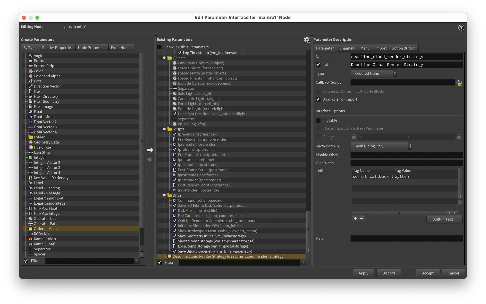

# Overriding the render strategy for Deadline Cloud Jobs

For many types of nodes, frames can be rendered independently and in any order. For others like simulations, each frame depends on the result of the previous frame and must be rendered sequentially. The submitter chooses a rendering strategy for each node based on its type, but also allows you to override the default.

## Parallel vs. Sequential Rendering

For parallel rendering, each frame has its own task, and the tasks will be distributed across available workers. For sequential rendering, all frames for a node are rendered in a single task running on a single worker.

By default, if a node is a geometry node with **Initialize Simulation OPs** enabled, it will render sequentially. Otherwise the node will render in parallel.

## Overriding the render strategy

You can override the render strategy by creating a `deadline_cloud_render_strategy` parameter on your render node (e.g. Mantra or Karma) with a value of either `SEQUENTIAL` or `PARALLEL`.

**To override render strategy by adding a parameter**

1. Open the context menu for a node in the **/out** network (right-click).
1. Choose **Parameters and Channels**, **Edit Parameter Interface**.
1. Under **Create Parameters**, **By Type**, choose **Ordered Menu**.
1. Add an ordered menu to **Existing parameters** by selecting the right arrow next to the **Create Parameters** column.
1. Select the new parameter under **Existing Parameters**, then edit its configuration under **Parameter Description**:
    * In the **Parameter** tab:
        * For **Name**, enter `deadline_cloud_render_strategy`.
        * For **Label**, enter `Deadline Cloud Render Strategy`.
    * In the **Menu** tab, add menu items for:

| Token      | Label      |
| ---------- | ---------- |
| SEQUENTIAL | Sequential |
| PARALLEL   | Parallel   |

1. Choose **Accept**.

Now in the parameter editor for your node, you can use the **Deadline Cloud Render Strategy** menu to specify submitter behavior.